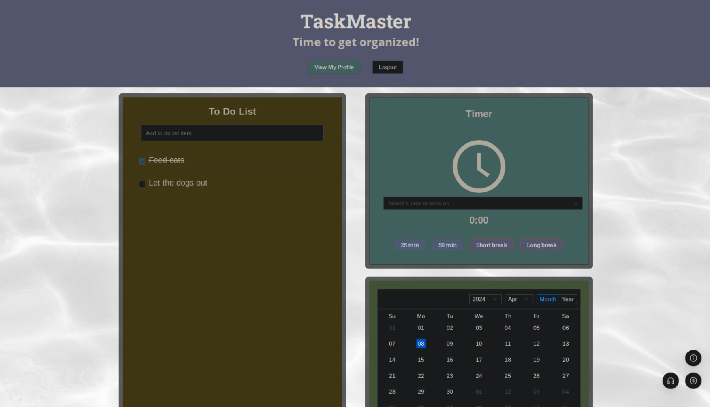

### TaskMaster

TaskMaster is a comprehensive productivity application designed to streamline your workflow and keep your team on track. TaskMaster provides essential features to enhance organization, focus, and relaxation. 

#### Table of Contents:
-   [Features](#features)
-   [Getting Started](#getting-started)
-   [Technologies Used](#technologies-used)
-   [Who to Blame](#who-to-blame)
-   [License](#license)

#### Features:

-   To-Do List: Stay organized by creating and managing tasks with ease. Prioritize your work and track progress effortlessly.
-   Built-in Timer: Boost productivity with a customizable timer for focused work sessions. Stay on track and maintain momentum throughout the day.
-   Guided Meditation: Take breaks and recharge with guided meditation sessions integrated seamlessly into your workflow.
-   Sound Board: Keep calm and focused with a built in sound board, pre filled with relaxing tracks.

#### Getting Started:

Deployed application: [TaskMaster](https://task-master-ahzg.onrender.com)

To run TaskMaster locally:
1.  Clone this repository to your local machine.
2.  Install dependencies using `npm install`.
3.  Start the application with `npm run start`.
4.  Access TaskMaster through your preferred web browser at `https://task-master-ahzg.onrender.com`.

#### Technologies Used:

-   React
-   Node.js
-   Express
-   MongoDB
-   Ant Design
-   Styled Components

#### Who to Blame:

-   [Evan](https://github.com/33649EK)
-   [Thomas](https://github.com/ThomasJHoltamIII)
-   [Hunter](https://github.com/huntrreed)
-   [Jadah](https://github.com/heyitsmejadah)

#### License:

This project is licensed under the MIT License.
